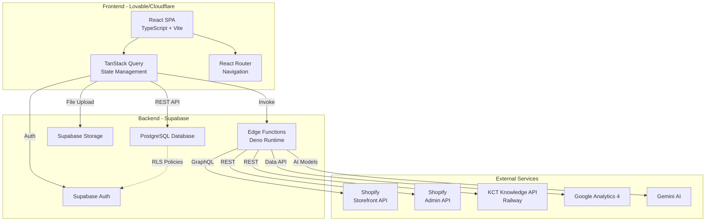

# KCT Menswear - System Architecture

## Overview

KCT Menswear is a headless fashion e-commerce platform specializing in men's formal wear with AI-powered styling recommendations and wedding party management.

## Technology Stack

### Frontend
- **Framework**: React 18 + TypeScript + Vite
- **Styling**: Tailwind CSS with custom design system
- **State Management**: TanStack Query (React Query)
- **Routing**: React Router v6
- **UI Components**: Radix UI + shadcn/ui
- **Animations**: Framer Motion
- **Deployment**: Lovable (Cloudflare Pages)

### Backend
- **Database**: Supabase (PostgreSQL)
- **Authentication**: Supabase Auth
- **Storage**: Supabase Storage
- **Serverless Functions**: Supabase Edge Functions (Deno)
- **External API**: KCT Knowledge API (Railway)

### Third-Party Services
- **E-commerce**: Shopify (Headless/Storefront API + Admin API)
- **Analytics**: Google Analytics 4
- **AI/ML**: Gemini AI (via Lovable AI integration)
- **Recommendations**: KCT Knowledge API

## System Architecture Diagram



## Data Flow Patterns

### 1. Product Catalog Flow
```
Shopify Admin → Categorize Products Edge Function → Supabase products table → Frontend Display
```

### 2. AI Recommendations Flow
```
User Input → Frontend → KCT Knowledge API → AI Analysis → Recommendations → Frontend
```

### 3. Wedding Management Flow
```
Coordinator Creates Wedding → Supabase weddings table → Invite Groomsmen → 
Measurement Collection → Order Processing → Status Updates
```

### 4. Analytics Flow
```
Frontend Events → Analytics Edge Functions → GA4 + Supabase → 
Dashboard Queries → KCT Knowledge API → Unified Analytics Display
```

## Key Feature Domains

### 1. E-Commerce Core
- **Product Catalog**: Synced from Shopify, enhanced with AI categorization
- **Shopping Cart**: Session-based and user-persisted
- **Checkout**: Shopify Customer Account API integration
- **Orders**: Multi-source order management (Shopify + Custom)

### 2. AI Styling & Recommendations
- **Complete the Look**: Outfit suggestions based on selected items
- **Size Recommendations**: AI-powered size fitting
- **Style Assistant**: Conversational AI for style advice
- **Outfit Validation**: Color/pattern compatibility checking
- **Visual Search**: Image-based product discovery

### 3. Wedding Party Management
- **8-Stage Workflow**: Inquiry → Consultation → Measurements → Order → Production → Alterations → Fitting → Event
- **Groomsmen Coordination**: Invite system with identity claiming
- **Group Measurements**: Centralized measurement collection
- **Custom Orders**: Wedding-specific product customizations

### 4. Analytics & Business Intelligence
- **Real-time Metrics**: Live visitor tracking
- **Sales Analytics**: Revenue, orders, conversion rates
- **Product Performance**: SKU-level analytics
- **AI Insights**: Recommendation effectiveness tracking

## Database Architecture

### Core Tables
- `products` - Product catalog from Shopify
- `orders` - Order management
- `cart_items` - Shopping cart persistence
- `user_profiles` - Extended user information

### Wedding Management
- `weddings` - Wedding events
- `wedding_party_members` - Groomsmen roster
- `measurements` - Size/fit data

### AI & Analytics
- `ai_style_memory` - User style preferences
- `ai_conversations` - Chat history
- `analytics_events` - Event tracking
- `analytics_sessions` - Session data

### Security
- Row Level Security (RLS) enabled on all user data tables
- Auth-based access control
- Admin-specific tables with elevated permissions

## Edge Functions Architecture

### Product Management
- `categorize-products` - AI categorization of Shopify products
- `get-product-by-handle` - Single product fetch

### AI Features
- `ai-size-recommendation` - Size fitting suggestions
- `enhanced-ai-size-bot` - Advanced sizing chat
- `ai-style-assistant` - Style advice chatbot
- `analyze-outfit-image` - Image analysis
- `generate-coordinated-outfits` - Outfit generation
- `parse-search-query` - Natural language search

### Wedding Features
- `register-wedding` - Create wedding event
- `claim-groomsman-identity` - Identity verification
- `send-wedding-invitation` - Email invitations

### Cart & Orders
- `cart-recovery-automation` - Abandoned cart tracking
- `send-cart-recovery-email` - Recovery emails

## API Integration Points

### Shopify Integration
- **Storefront API**: Product browsing, cart management
- **Customer Account API**: Checkout and authentication
- **Admin API**: Order management, inventory sync

### KCT Knowledge API
- **Base URL**: `https://kct-knowledge-api-2-production.up.railway.app`
- **Endpoints**:
  - `/api/recommendations/complete-look` - Outfit suggestions
  - `/api/outfit/validate` - Outfit validation
  - `/api/analytics/dashboard` - Unified analytics
  - `/api/analytics/realtime` - Live metrics
  - `/api/chat/*` - Conversational AI

### Supabase Services
- **Database**: PostgreSQL with PostgREST API
- **Auth**: Email/password, OAuth providers
- **Storage**: Buckets for avatars, measurements, product images
- **Edge Functions**: Deno-based serverless functions

## Environment Configuration

### Frontend (.env)
- `VITE_SUPABASE_URL` - Supabase project URL
- `VITE_SUPABASE_PUBLISHABLE_KEY` - Anon key
- `VITE_SHOPIFY_STOREFRONT_TOKEN` - Storefront API token
- `VITE_SHOPIFY_CUSTOMER_ACCOUNT_CLIENT_ID` - Customer Account API
- Marketing pixels (Meta, TikTok, GA, Google Ads)

### Backend (Supabase Secrets)
- `LOVABLE_API_KEY` - AI features
- `SHOPIFY_STOREFRONT_TOKEN` - Product sync
- `SHOPIFY_DOMAIN` - Store domain
- `SHOPIFY_ADMIN_ACCESS_TOKEN` - Admin API (if used)

## Deployment

### Frontend
- **Platform**: Lovable → Cloudflare Pages
- **Trigger**: Git push to main branch
- **Build**: Automatic via Lovable
- **CDN**: Cloudflare global network

### Backend
- **Platform**: Supabase
- **Database**: Managed PostgreSQL
- **Edge Functions**: Auto-deploy on push
- **Region**: Configurable per project

### External API
- **Platform**: Railway
- **Repository**: Separate from main app
- **Auto-deploy**: Git push triggers Railway build

## Performance Considerations

### Caching Strategy
- TanStack Query caching for API responses
- Stale-while-revalidate for product data
- Redis caching in KCT Knowledge API

### Optimization
- Code splitting via React.lazy
- Image optimization via Cloudflare
- Edge function cold start optimization
- Database indexes on frequently queried columns

## Security Architecture

### Frontend Security
- No sensitive keys in client code (only anon key)
- CORS configuration for API requests
- Content Security Policy via Cloudflare

### Backend Security
- Row Level Security (RLS) policies on all tables
- Service role key never exposed to client
- API rate limiting via edge functions
- JWT token validation for authenticated requests

### Data Privacy
- User data isolated via RLS
- GDPR-compliant data handling
- Secure password hashing via Supabase Auth

## Development Workflow

1. **Local Development**: `npm run dev` (port 8080)
2. **Database Changes**: Supabase migrations via Lovable tools
3. **Edge Function Updates**: Auto-deploy on file save
4. **Testing**: Browser console + Supabase logs
5. **Deployment**: Git push → Automatic via Lovable

## Monitoring & Debugging

### Available Tools
- Supabase Dashboard: Database logs, auth logs, function logs
- Browser DevTools: Network tab, console logs
- KCT Knowledge API: Railway logs
- Analytics: GA4 real-time reports

### Common Debug Points
- Edge function logs: Supabase Dashboard → Functions → Logs
- Database queries: Supabase Dashboard → Database → Logs
- API responses: Browser Network tab
- Auth issues: Supabase Dashboard → Authentication → Logs

## Future Scalability

### Ready for Scale
- Serverless architecture (auto-scaling)
- CDN distribution (global performance)
- Database connection pooling (Supabase built-in)
- Stateless edge functions

### Growth Considerations
- Database query optimization via indexes
- Image CDN for product photos
- API rate limiting per user tier
- Caching layer for high-traffic endpoints

---

**Last Updated**: 2025-01-30  
**Version**: 1.0  
**Maintainer**: Development Team
